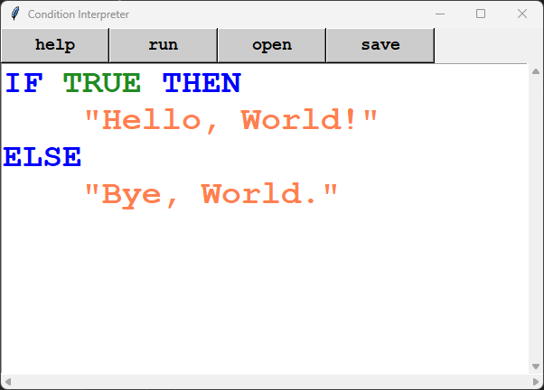
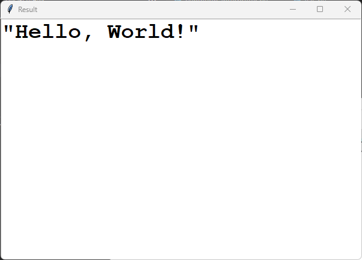

# Simple condition interpreter

### Info

Description
```
TERM:
    IF
    TRUE
    FALSE
    THEN
    ELSE
    STRING
NOTE:
    STRING begins with a quote and ends with the first quote.
    Quote is a symbol `"`.

CONDITION:
    IF [TRUE | FALSE] THEN
        [STRING | CONDITION]
    ELSE
        [STRING | CONDITION]
NOTE:
    It is required to register a pair of IF and ELSE.
    Terms in the terms must be separated by at least one space.
    Spaces are ` `, \\t, \\v, \\n, \\r, \\f.
```

EBNF
```
    <condition> =   "IF" <space> <boolean> <space> 
                    "THEN" <space>
                        ( <string> | <condition> ) <space>
                    "ELSE"
                        ( <string> | <condition> ) <space> ;
    <bolean>    =   "TRUE" | "FALSE" ;
    <space>     =   " " | "\\t" | "\\n" | "\\v" | "\\f" | "\\r" ;
    <string>    =   "\\"" { <char> } "\\"" ;
    <char>      =   <utf-8> - "\\""
```

IDE
```bash
IDE.py
```

---

### Prerequisites


Language version starting from ```Python 3.10+``` for condition interpreter.

```bash
$ python --version
Python 3.10.4
```

Packages ```re``` and ```tkinter``` for IDE

---

### Usage

```bash
$ python IDE.py
```
or
```bash
$ python
>>> from condition_interpreter import ConditionInterpreter   
>>> ci = ConditionInterpreter('IF TRUE THEN "Hello, World!" ELSE "Bye, World."')   
>>> ci.run()
'"Hello, World!"'
```

---

### Demo

demo 1



run 1



---

### Authors

* [Dmitry Volkov](https://github.com/d1mav0lk0v)

---

### Link

* [GitHub](https://github.com/d1mav0lk0v/condition_interpreter.git)

---